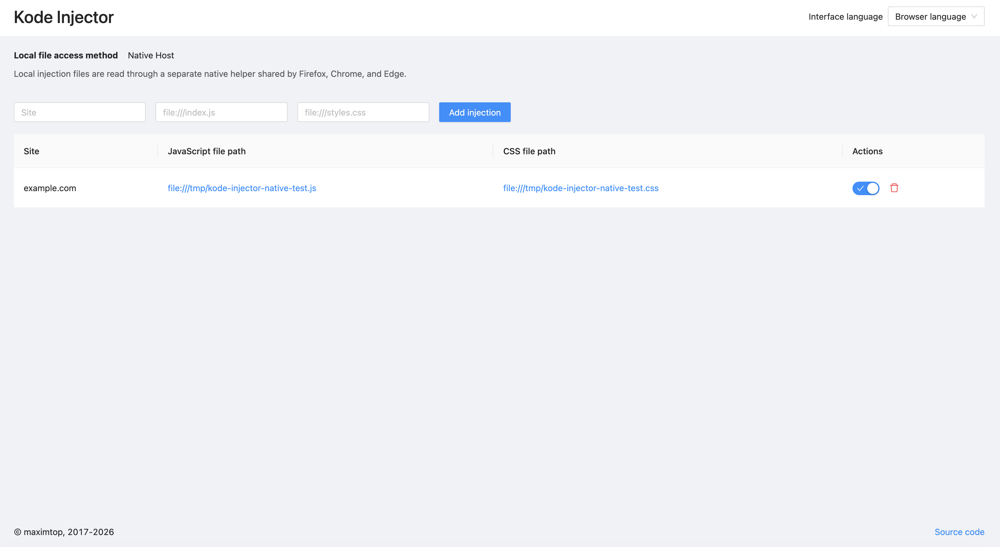

# Kode Injector

> Inject JavaScript and CSS from local files into specified websites — for
> developers, QA testers, and designers who need to apply custom code to live
> pages.

<p align="center">
  <!-- TODO: add screenshot -->
  
</p>

## Description

Kode Injector is a browser extension for web developers, QA testers, and
designers who need to inject custom JavaScript and CSS code into live websites.

During development, debugging, or visual review you often need to override or
add code on a page that you do not control. Re-pasting snippets into DevTools
on every page load is repetitive and error-prone. Kode Injector solves this by
mapping local files (using `file:///` URLs) to website hostnames. When you visit
a matching site, the extension automatically injects the associated JavaScript
and CSS — every time, without manual steps.

## Table of Contents

- [Installation](#installation)
- [Quick Start](#quick-start)
- [Features](#features)
- [Permissions](#permissions)
- [FAQ / Troubleshooting](#faq--troubleshooting)
- [Documentation](#documentation)

---

## Installation

[](
  https://chrome.google.com/webstore/detail/kode-injector/fgdehkdkmaiedleekbjpfoicpmodbicg
)

Install Kode Injector from the Chrome Web Store. Chrome and Edge use the
browser's built-in local-file access by default, so they do not require a
separate application. Open the extension's details in the browser and enable
**Allow access to file URLs** when the warning appears in Kode Injector.

Firefox reads local files through the separately installed **Kode Injector
Helper**. Chrome and Edge can use the same read-only helper as an optional
alternative; select **Native Host** in Kode Injector settings to request the
browser permission and switch methods.

Options automatically links to the package for the installed extension version
and the current operating system and architecture. **View all downloads** opens
the complete [GitHub Releases page](https://github.com/maximtop/kode-injector/releases)
when automatic selection is unavailable. Each platform build is a separate
asset; users never need to download a bundle containing other systems.

On macOS:

1. Download `kode-injector-helper-macos-apple-silicon.dmg` on an Apple Silicon
   Mac or `kode-injector-helper-macos-intel.dmg` on an Intel Mac.
2. Open the disk image and drag **Kode Injector Helper** to **Applications**.
   If you cannot write to the system Applications folder, choose **Go → Home**
   in Finder, create an `Applications` folder there if needed, and drag the app
   into that folder instead. This per-user location needs no administrator
   password.
3. Open **Kode Injector Helper** from Applications, Spotlight, or Launchpad and
   click **Install**. No Terminal or administrator password is required.
4. Return to Kode Injector Options and click **Check again**.

The application remains in the system or Home Applications folder so it is easy
to find later. Reopen it to inspect browser registration status, repair or
reinstall registrations, or
uninstall them. To remove it completely, click **Uninstall** in the application
first, then move **Kode Injector Helper** from its Applications folder to Trash.
The helper does not install a daemon, login item, automatic updater, or hidden
executable copy.

On Linux, extract the package for your architecture and run these commands from
the extracted directory:

```sh
./kode-injector-installer install
./kode-injector-installer uninstall
```

On Windows, extract the package for your architecture and run these commands in
PowerShell from the extracted directory:

```powershell
.\kode-injector-installer.exe install
.\kode-injector-installer.exe uninstall
```

Both installers operate only for the current user and require no administrator
or root access. Keep the installer and `kode-injector-native` executable
together when installing. The archive's `README.txt` contains the same commands
and the unpacked-extension development flow.

### Install from source

To run the latest development build from source:

1. Clone the repository.
2. Run `pnpm dev` to create development builds for Chrome, Edge, and Firefox.
3. In Chrome or Edge, open the browser's extensions page and enable
   **Developer mode**.
4. Click **Load unpacked** and select `build/dev/chrome/` for Chrome or
   `build/dev/edge/` for Edge.
5. Open the unpacked extension's details and enable **Allow access to file
   URLs** to use the default browser-file method.

For Firefox, open `about:debugging`, select **This Firefox**, click
**Load Temporary Add-on**, and select `build/dev/firefox/manifest.json`.

Install Kode Injector Helper for your operating system before testing Firefox.
To test the optional Native Host method with unpacked Chrome or Edge,
copy the displayed extension IDs into `native-host/dev-extension-ids.json`
using the committed example, then run the packaged installer's explicit
development-registration flow. Review the printed origins before confirming
them. Production installation ignores this local file. Until an Edge Add-ons
ID is configured for a release, production registration contains the Chrome
Store origin only; unpacked Edge remains supported through the explicit
development-registration flow.

See [DEVELOPMENT.md](DEVELOPMENT.md) for full setup details.

## Quick Start

1. Install the extension from the Chrome Web Store (or load it from source).
2. Navigate to a website where you want to inject code.
3. Click the **Kode Injector** toolbar icon, then click the settings button to
   open the options page.
4. In the **Add injection** form, enter the site hostname, a `file:///` path to
   your JavaScript file, and a `file:///` path to your CSS file, then click
   **Add injection**.
5. Reload the target site — your JavaScript and CSS are now injected
   automatically.

## Features

### Injection rules

Create rules that map a website hostname to local JavaScript and CSS files.
Each rule specifies:

- **Site** — the hostname to match (e.g. `example.com`).
- **JS file path** — a `file:///` URL to a JavaScript file.
- **CSS file path** — a `file:///` URL to a CSS file.

Matching rules are applied automatically whenever you visit the site.

### Local file access methods

Chrome and Edge initially read configured `file:///` URLs through the browser.
This preserves the extension's established behavior and requires only the
browser-managed **Allow access to file URLs** toggle. The separately installed
Native Host is optional in these browsers. Choosing it in Options requests the
optional `nativeMessaging` permission; declining the request leaves browser
file access selected.

Firefox always uses Kode Injector Helper because extension pages cannot
directly load arbitrary local files. The host is read-only and uses the same configured
`file:///` paths; no rule migration is needed when changing methods in Chrome
or Edge.

### Manage injections

Open the options page to view all your injection rules in a table. From there
you can:

- **Toggle** an injection on or off without deleting it.
- **Delete** an injection permanently.
- Click a file path to open the referenced local file in a new tab.

### Per-site control

The toolbar popup shows the current site's hostname and lets you enable or
disable all injections for that site with a single switch.

### Global pause

Need to temporarily stop all injections across every site? Use the pause button
in the popup header to suspend injecting everywhere, then resume with one click
when you are ready.

### Localized interface

The interface is available in 30 languages, including English and Russian.
The options page header has a language selector; choose **Browser language** to
follow the browser UI automatically, or select a specific language. Changes
apply immediately in open options pages and popups. Unsupported browser
languages use English, and the extension preserves the browser's direction for
Arabic, Persian, and Hebrew.

The extension's manifest name and description remain controlled by the browser's
WebExtension locale rules. The in-app selector changes the options and popup
interface only.

## Permissions

| Permission | Availability | Reason |
| --- | --- | --- |
| `storage` | All browsers | Save injection rules, settings, and the per-site blocklist |
| `scripting` | All browsers | Inject JavaScript and CSS into web pages |
| `activeTab` | All browsers | Read the current tab's URL to match injection rules |
| `nativeMessaging` | Required in Firefox; optional in Chrome and Edge | Ask the separately installed read-only helper to read configured local files |
| `<all_urls>` (host permission) | All browsers | Run the content script and apply injections on any website |

---

## FAQ / Troubleshooting

**My code isn't being injected.**

Check that the injection rule's **Site** field matches the page's hostname,
that the file paths are valid `file:///` URLs, and that the injection is enabled
in the options table. Make sure the extension is not paused globally or disabled
for the current site via the popup.

**The popup shows "No injections".**

No injection rules match the current site's hostname. Open the options page and
add a rule for this site.

**The extension can't read my local file.**

Ensure the path is a valid `file:///` URL and that the file exists at that
location. In Chrome or Edge browser-file mode, open the extension's browser
settings, enable **Allow access to file URLs**, then use **Check again** in
Options. In Firefox or Native Host mode, install or update **Kode Injector
Helper** and check again. The helper only reads explicitly requested local
regular files up to 5 MiB. It cannot write files, execute programs, list
directories, or access the network.

Helper updates are manual. Options links to the package matching the installed
extension; copy the newer **Kode Injector Helper** to Applications, open it,
and choose **Reinstall** or **Repair**. To uninstall, find **Kode Injector
Helper** in the system or Home Applications folder, Spotlight, or Launchpad,
open it, click **Uninstall**,
then move the app to Trash. This removes Kode Injector browser registrations
without touching extension rules or settings.

**Should I use Native Host in Chrome or Edge?**

Browser file access is the simplest default and does not require another
application or the `nativeMessaging` permission. Native Host avoids depending
on the browser's file-URL toggle and provides the same file-size limits and
diagnostics as Firefox. It is an interoperability choice, not a performance
optimization.

**How do I inject only JavaScript or only CSS?**

Currently each rule requires both a JS and a CSS file path. If you only need
one type, point the other field at an empty file.

---

## Documentation

- [Development](DEVELOPMENT.md) — how to set up and contribute
- [LLM agent rules](AGENTS.md) — AI-assisted development guidelines
- [Report an issue](https://github.com/maximtop/kode-injector/issues/new)
